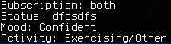

.. _pep-details:

Personal Events
===============

Starting from poezio 0.8, poezio now supports `user mood`_, `user activity`_,
`user tune`_, and `user gaming`_.

Those extensions are standardized ways to broadcast information that might be
useful to your contacts (they will receive those information only if they
have indicated their interest in them).

The events are also shown in the contact list, next to the contact line:

On the above figure, A stands for Activity, M for Mood, and G for Gaming.

The details are shown with notifications if configured, and in the detailed
contact information window, on the bottom left in the contact list tab.

You can see below the list of the related options and commands.

.. note::

    All the *display_foo_notifications* options can be tab-specific, so you
    can display those notifications only for a specific contact, or the
    other way around.

User Mood
~~~~~~~~~

Options:

- :term:`enable_user_mood`
- :term:`display_mood_notifications`

Commands:

- :term:`/mood`

User Activity
~~~~~~~~~~~~~

Options:

- :term:`enable_user_activity`
- :term:`display_activity_notifications`

Commands:

- :term:`/activity`

User Gaming
~~~~~~~~~~~

Options:

- :term:`enable_user_gaming`
- :term:`display_gaming_notifications`

Commands:

- :term:`/gaming`

User Tune
~~~~~~~~~

Options:

- :term:`enable_user_tune`
- :term:`display_tune_notifications`

.. note::

    There is no /tune command because it wouldn’t be really useful.
    There was originally a way to broadcast the current tune with the
    mpd plugin, but it was no good. You should use an external script
    to do that, or use a player that has the feature.

.. _user mood: http://xmpp.org/extensions/xep-0107.html
.. _user tune: http://xmpp.org/extensions/xep-0118.html
.. _user gaming: http://xmpp.org/extensions/xep-0197.html
.. _user activity: http://xmpp.org/extensions/xep-0108.html
