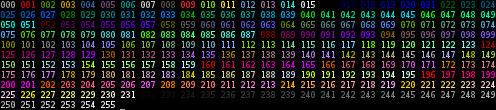

Themes
======

This page describes how themes work in poezio and how to create or
modify one.

A theme contains color attributes and character definitions. Poezio can display
up to **256** colors if your terminal supports it. Most of the time,
if it doesn’t work, that’s because the **$TERM** environnment variable is
wrong. For example with tmux or screen, set it to **screen-256color**, in
**xterm**, set it to **xterm-256color**, etc.

If your terminal doesn’t have 256 colors, only 8 colors will be available,
and poezio will replace the colors by one of the 8 values available.
Thus, some theme files may not work properly if you only have 8 colors,
for example light gray on dark gray may be converted to black on black, making
the text impossible to read).

.. note:: The default theme should work properly in any case. If not, that’s a bug.

A theme file is a python file (with the .py extension) containing a
class, inheriting the *theming.Theme* class defined into the *theming*
poezio module.

To check how many colors your current terminal/$TERM supports, do:

.. code-block:: bash

    tput colors

Create a theme
--------------

To create a theme named foo, create a file named foo.py into the theme
directory (by default it’s :file:`~/.local/share/poezio/themes/`) and
add:

.. code-block:: python

    import theming

    class FooTheme(theming.Theme):
          # Define here colors for that theme
    theme = FooTheme()

To define a *color pair* and assign it to the *COLOR_NAME* option, just do

.. code-block:: python

    class FooTheme(theming.Theme):
          COLOR_NAME = (fg_color, bg_color, opt_attr)

You do not have to define all the :ref:`available-options`,
you can decide that your theme will only change some options, the other
one will just have the default value (from the default theme).

Colors and attributes
~~~~~~~~~~~~~~~~~~~~~
A color pair defines how the text will be displayed on the screen. It
has a **foreground color** (``fg_color``), a **background color**
(``bg_color``) and an **optional attribute** (``opt_attr``).

Colors
^^^^^^
A color is a number between ``-1`` and ``255``. If it is ``-1``, this is
the default color defined by your terminal (for example if your terminal
displays white text on black by default, a ``fg_color`` of ``-1`` is white,
and a ``bg_color`` of ``-1`` is black). If it’s between 0 and 256 it
represents one of the colors on this image:

    The list of all 256 colors

Attributes
^^^^^^^^^^
An attribute is a python string (so, it has to be surrounded by
simple or double quotes). It can be one of the following:

- ``'b'``: bold text
- ``'u'``: underlined text

Use a theme
-----------
To use a theme, just define the :term:`theme` option into the
:ref:`configuration file <config>` to the name of the theme you want
to use. If that theme is not found, the default theme will be used instead.

Note that the default theme is defined directly into poezio’s source code,
and not in a theme file.

Change the theme directory
--------------------------
To change the default theme directory
(:file:`~/.local/share/poezio/themes/` by default),
you have to change the :term:`themes_dir` option in the
:ref:`configuration file <config>` to the directory that
contains your theme files.

.. _available-options:

Available options
-----------------

.. warning:: This section is not complete.

All available options can be found into the default theme, which is into the
**theming.py** file from the poezio’s source code.

.. autoclass:: poezio.theming.Theme

