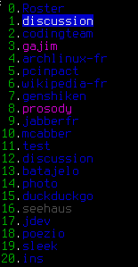
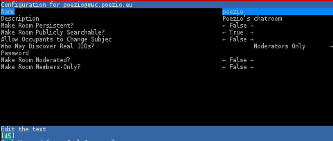
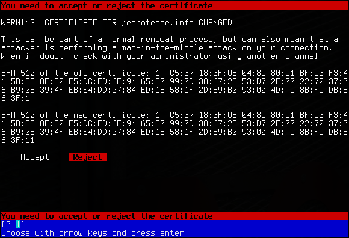
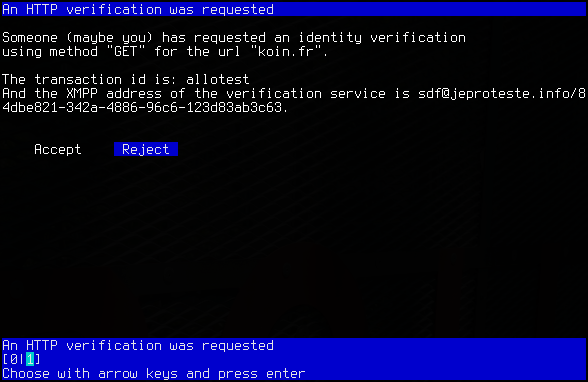
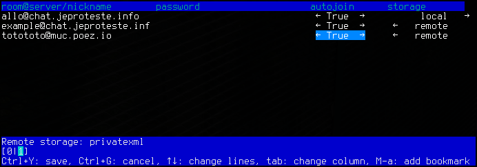

.. _usage:

Usage
=====

This page is the main page of the documentation for poezio, explaining how to
use it and describing its interfaces.

Poezio is composed of tabs which can be of various types. Each tab type has
a distinct interface, list of commands and list of key shortcuts, in addition
to the global commands and key shortcuts.

Tab list
~~~~~~~~

There are two ways of showing the open tabs:

Horizontal list
^^^^^^^^^^^^^^^

This is the default method.

On all tabs, you get a line showing the the list of all opened tabs. Each tab
has a number, each time you open a new tab, it gets the next available number.

Vertical list
^^^^^^^^^^^^^

On all tabs, you get a pane on the left side of the screen that shows a list
of the opened tabs. As stated above, each tab has a number, and each time you
open a new tab, it gets the next available number.

This mode is enabled by setting the
:term:`enable_vertical_tab_list` option to ``true`` in the
configuration file.

Options for the tab list
^^^^^^^^^^^^^^^^^^^^^^^^

The following options are used to configure the behavior of the tab list:

- :term:`enable_vertical_tab_list`
- :term:`vertical_tab_list_size`
- :term:`vertical_tab_list_sort`
- :term:`show_tab_names`
- :term:`show_tab_numbers`
- :term:`show_inactive_tabs`
- :term:`use_tab_nicks`

Generalities
~~~~~~~~~~~~

:ref:`global-commands`

:ref:`Global shortcuts <global-keys>`

The tab numbered **0** is always the **Contact list** tab, the other tabs can be of any
type.

The status of a tab is represented by its color:

* **Blue** (tab **0**): an inactive tab of any type, nothing new to see
  there.
* **Purple** (tab **1**): a :ref:`muctab` with at least one new
  unread message.
* **Green** (tab **2**): a tab of a private conversation (:ref:`privatetab` or :ref:`conversationtab`)
  with a new message to read.
* **Cyan** (tab **3**): the current tab.
* **Red** (tab **4**): a :ref:`muctab` with at least one new highlight
  message.

You can go from one tab to another in many ways:

* ``Ctrl+n`` (next tab) and ``Ctrl+p`` (previous tab)
* :term:`/win` command
* :term:`/next` and :term:`/prev` commands
* ``Alt`` + a number (to go to the tab with that number)
* ``Alt+j`` followed by a two-digits number (same)
* ``Alt+e``, this will jump to the next tab with the highest priority. Priority
  applies in this order: private message > highlight message > normal message.
* :term:`/close` command to close a tab and go back to the previous one

.. _rostertab:

Contact list tab
~~~~~~~~~~~~~~~~

:ref:`Specific commands <rostertab-commands>`

:ref:`Specific shortcuts <rostertab-keys>`

.. note:: The contact list also called a roster in XMPP terms.

This is a unique tab, always numbered **0**. It contains the list of your
contacts. You can add (:term:`/add`, :term:`/accept`), remove
(:term:`/remove`) and search contacts from there, and you can open
a conversation with them (``Enter`` key).

Use the **direction arrows** (↑↓) to browse the list, the ``Space`` key to
fold or unfold a group or a contact.

.. figure:: ./images/roster.png
    :alt: The contact list tab

#. Area where information messages are displayed.
#. Actual list of contacts. The first level is group, the second is the
   contacts and the third is the resources of your online contacts.
#. More information about the selected contact.

.. _muctab:

Chatroom tab
~~~~~~~~~~~~

:ref:`Specific commands <muctab-commands>`

:ref:`Specific shortcuts <muctab-keys>`

:ref:`Chat shortcuts <chattab-keys>`

.. note:: A chatroom is also called a MUC (for Multi-User-Chat) in XMPP terms.

This tab contains a multi-user conversation.

.. figure:: ./images/muc.png
    :alt: The chatroom tab

#. The conversation window, this is where all the messages and events
   related to the muc will be displayed. It can be scrolled up and down with
   ``PageUp`` and ``PageDown``.
#. The participant list. Participants are listed by their role first, and
   then alphabetically.
   The status of each participant is symbolized using the **color** of the
   character on the left of its nick.
   That character also shows the chatstate of each participant:

   - ``|``: inactive
   - ``X``: composing
   - ``A``: active
   - ``p``: paused

   The roles and affiliations of the participants are symbolized by the char
   before the nick and its color.
   The characters define the affiliations, and they mean:

   - ``~``: Owner
   - ``&``: Admin
   - ``+``: Member
   - ``-``: None

   And their color define their roles, and they mean:

   - **Red** : moderator
   - **Blue**: participant
   - **Grey**: visitor

   The nicks have a fixed color assigned using XEP-0392_.

#. Your information in that chatroom (the name of the room, your nick, your role
   and affiliation).
#. The topic of the room.

You can configure the room (if you have the rights to do it) using the
:term:`/configure` command, open a private conversation with someone using the
:term:`/query` command, change or view the topic using the :term:`/topic` command…

.. _privatetab:

Private tab
~~~~~~~~~~~
:ref:`Specific commands <privatetab-commands>`

:ref:`Chat shortcuts <chattab-keys>`

This is the tab opened with the :term:`/query` command in a :ref:`muctab`, letting you talk in private
with a participant of a multi-user chat.

.. figure:: ./images/private.png
    :alt: The private tab

This is just a simple one to one conversation, with a line showing the status,
name and chatstate of the participant.

.. _conversationtab:

Conversation tab
~~~~~~~~~~~~~~~~

:ref:`Specific commands <conversationtab-commands>`

:ref:`Chat shortcuts <chattab-keys>`

A tab opened by interacting with the contact list or :term:`/message`,
to talk in private with one of your contacts.

.. figure:: ./images/conversation.png
    :alt: The conversation tab

This is also just a simple one to one conversation, with a line showing the status,
name and chatstate of the participant, as well as a line at the top showing the
status message of the contact. Plugins may add some elements to the status line.

.. _dataformtab:

Dataforms tab
~~~~~~~~~~~~~

:ref:`Specific shortcuts <forms-keys>`

This tab lets you view a form received from a remote entity, edit the values and
send everything back. It is mostly used to configure chatrooms with the
:term:`/configure` command but can actually be used for almost anything.

Use the ``Up`` and ``Down`` keys to go from one field to the other, and edit the
value using the ``Space``, ``Left`` or ``Right`` keys, or by entering text.

You can then send the completed form using ``Ctrl+y`` or cancel using ``Ctrl+g``.

.. _listtab:

List tab
~~~~~~~~

:ref:`Specific shortcuts <muclisttab-keys>`

This tab lists all public rooms on a chatroom service (with the :term:`/list` command).
It is currently very limited but will be improved in the future. There currently
is no way to search a room.

.. figure:: ./images/list.png
    :alt: The list tab

Use the ``Up`` and ``Down`` or ``PageUp`` and ``PageDown`` keys to browse the list, and
use ``Enter`` or ``j`` to join the selected room.

You can sort the rooms by moving the direction arrows (``←`` or ``→``) and pressing
``Space`` when you are on the appropriate column.

.. _confirmtab:

Confirm tab
~~~~~~~~~~~

This kind of tab is used to prompt a binary choice to the user due to external
events, such as a certificate change:

Or a XEP-0070_ validation:

.. _bookmarks tab:

Bookmarks tab
~~~~~~~~~~~~~

This tab can be obtained using :term:`/bookmarks`, it is a graphical interface
for managing bookmarks. You can edit the bookmark address itself, its password,
the storage backend, and the autojoin status. Note that local bookmarks always
have autojoin set to True.

.. _XEP-0070: https://xmpp.org/extensions/xep-0070.html
.. _XEP-0392: https://xmpp.org/extensions/xep-0392.html
